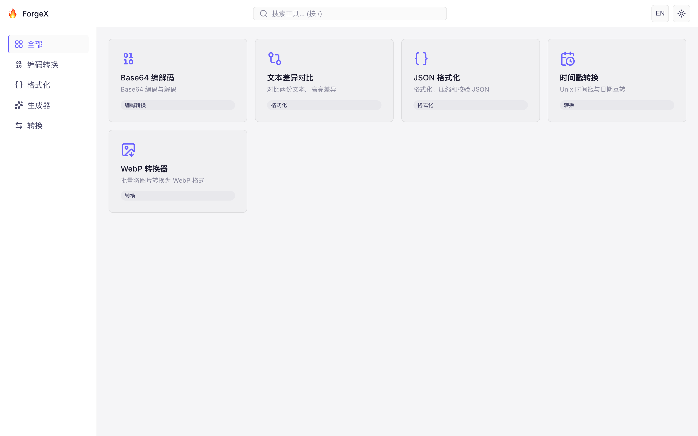
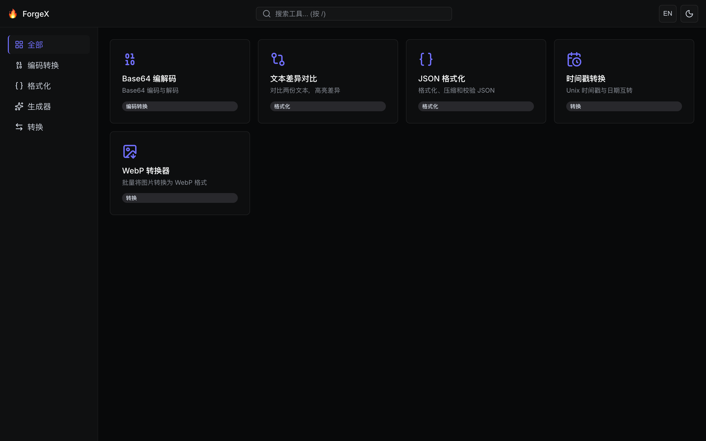
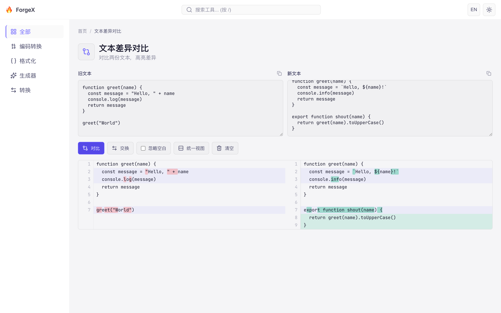
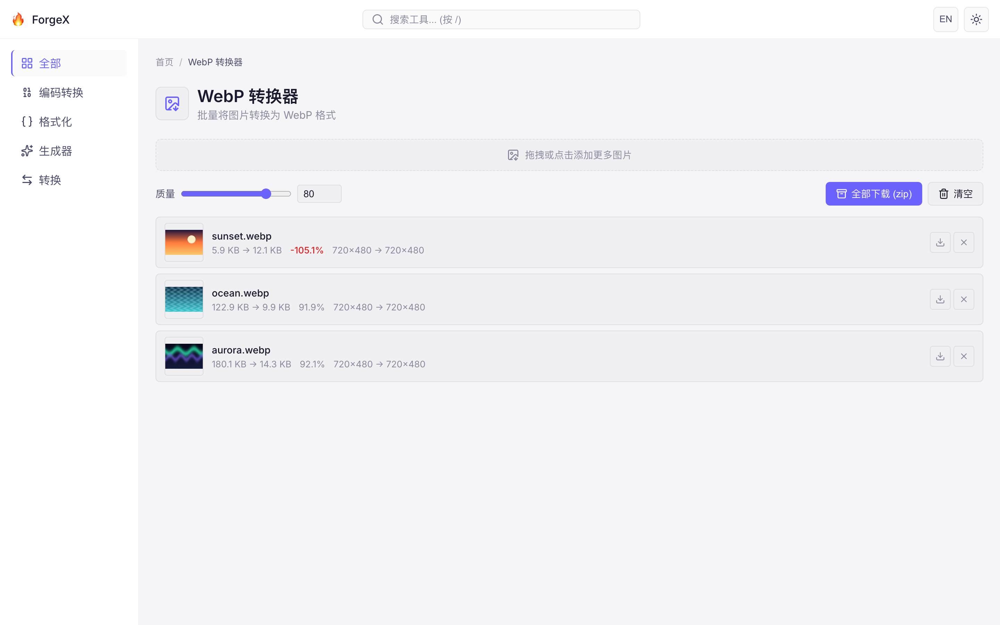
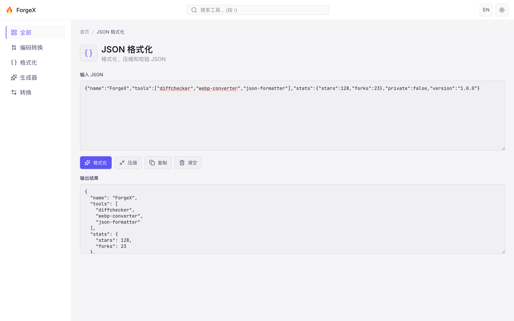
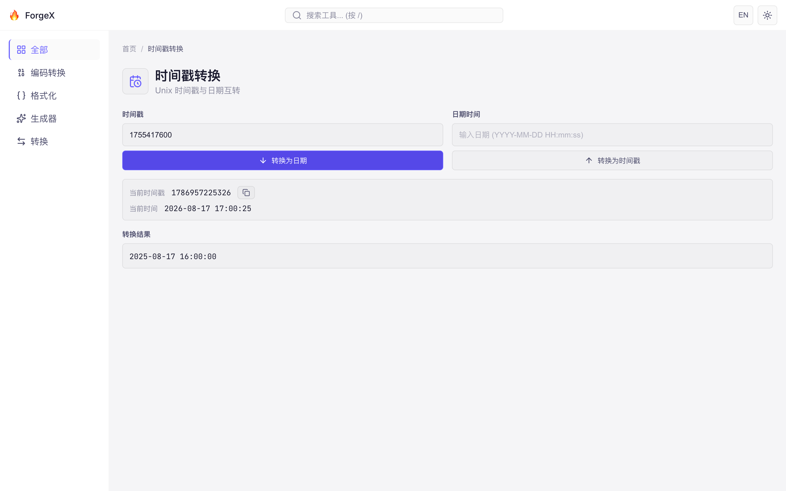
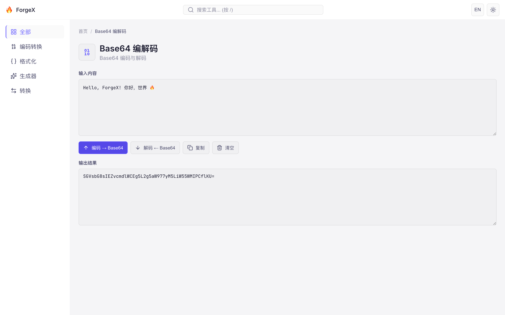

# 🔥 ForgeX —— 开箱即用的浏览器开发者工具箱

ForgeX 是一个纯前端的开发者小工具平台：文本对比、图片转 WebP、JSON 格式化、时间戳转换、Base64 编解码……所有工具都在**你的浏览器本地**运行，无需安装、无需注册，打开即用。

> 🔒 **隐私友好**：所有文本与图片都在本地处理，不会上传到任何服务器。断网也能用。





## ✨ 为什么选择 ForgeX

- **零安装**：打开网页就能用，手机、平板、电脑通吃
- **隐私安全**：文件与文本全程不离开你的设备
- **深色 / 浅色主题**：一键切换，跟随系统偏好
- **中文 / English**：界面双语，右上角随时切换
- **快速搜索**：顶栏搜索或按 `/` 键，输入关键词直达工具

## 🧰 内置工具

### 📝 文本差异对比

粘贴两份文本，一键高亮差异。支持**左右分栏 / 统一视图**两种展示、行内字符级高亮、忽略空白、左右交换，并自动归一化 CRLF / LF 换行符，不再被换行风格干扰。



### 🖼️ WebP 转换器

批量把 PNG / JPG / GIF / BMP / SVG 转成 WebP，实时显示压缩率与尺寸；动画图片自动取第一帧并明确标注。支持调整质量、单文件下载或一键打包 ZIP。



### 🧾 JSON 格式化

粘贴 JSON，一键**格式化**或**压缩**；语法错误即时提示，结果可直接复制。



### 🕒 时间戳转换

Unix 时间戳 ↔ 日期时间双向转换，实时显示当前时间戳，复制一下就能用。



### 🔐 Base64 编解码

文本与 Base64 互相转换，支持中文与 Emoji，编码 / 解码一键完成。



## 🚀 本地运行（开发者）

需要 [Node.js](https://nodejs.org/) 与 [pnpm](https://pnpm.io/)：

```bash
# 安装依赖
pnpm install

# 启动开发服务器（默认 http://localhost:5173/forge-x/）
pnpm dev

# 类型检查 + 生产构建
pnpm build

# 运行单元测试
pnpm test

# 运行端到端测试（Playwright）
pnpm test:e2e
```

## 🛠️ 技术栈

- [Vue 3](https://vuejs.org/)（`<script setup>` + TypeScript）
- [Vite](https://vite.dev/) 构建
- [Pinia](https://pinia.vuejs.org/) 状态管理 + [Vue Router](https://router.vuejs.org/)
- [jsquash](https://github.com/jamsinclair/jSquash)（WASM WebP 编码）+ Canvas 混合编码
- [diff](https://github.com/kpdecker/jsdiff) 文本差异算法
- [Vitest](https://vitest.dev/) 单元测试 + [Playwright](https://playwright.dev/) 端到端测试

## 📁 项目结构

```
src/
├── components/     # 通用组件（头部、侧栏、工具卡片等）
├── tools/          # 每个工具一个目录：Vue 组件 + 元数据 + 逻辑与测试
├── views/          # 页面视图
├── stores/         # Pinia stores（工具注册、主题、语言）
├── locales/        # 中 / 英文案
└── styles/         # 全局样式与设计变量
```

## 🤝 贡献

欢迎提交 Issue 与 Pull Request！新增工具只需在 `src/tools/` 下新建目录，提供组件与元数据（id、名称、描述、分类、图标、关键词），路由与首页卡片会自动注册。
